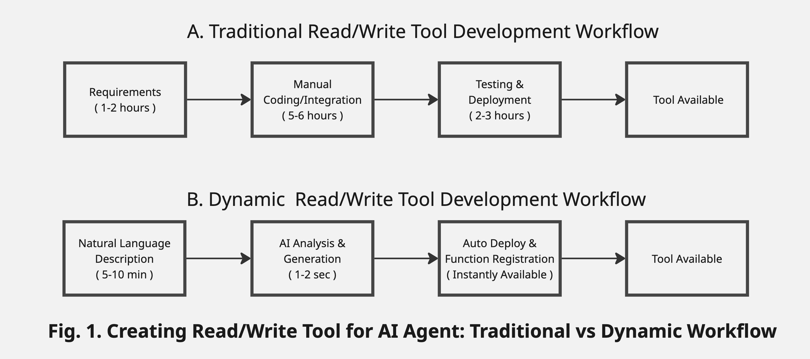
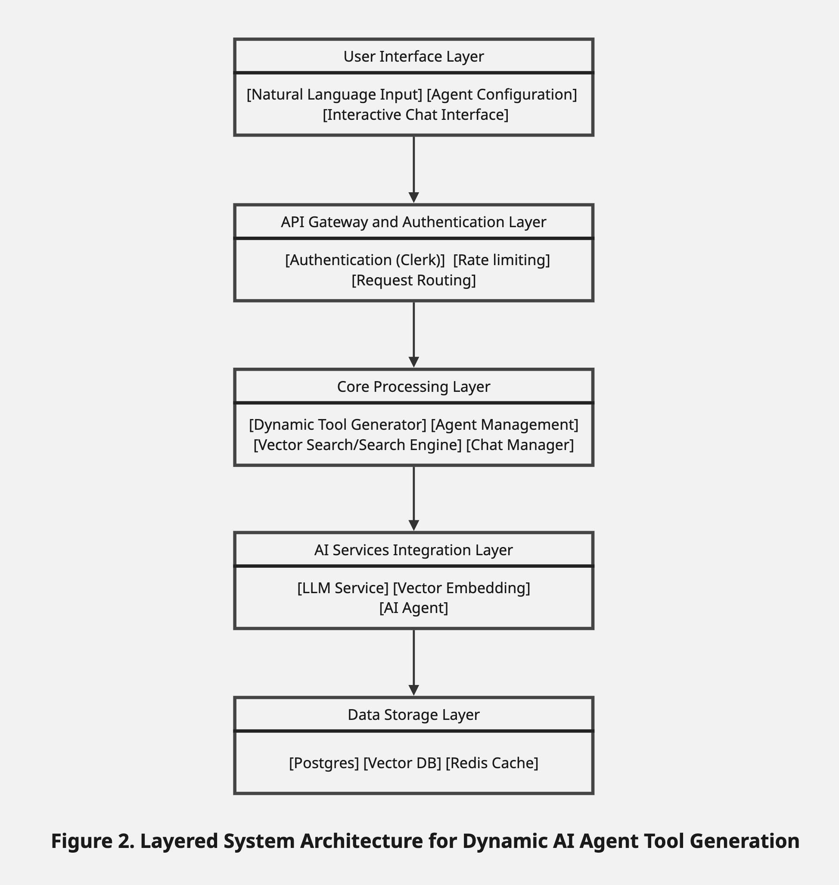
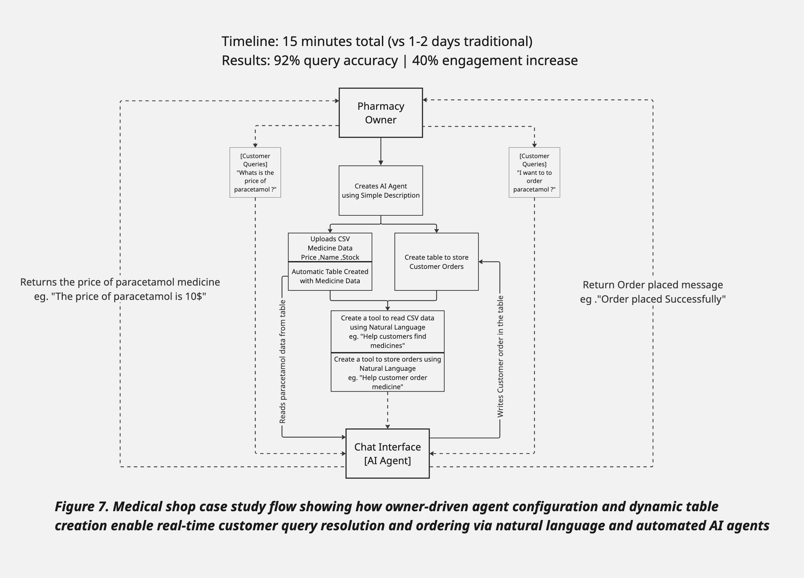

## Diagrams

### Fig 1: Traditional vs Dynamic Tool Development Workflow

*Comparison of traditional manual development steps with the new dynamic workflow for AI agent tool creation. Shows time and process differences for building read/write tools.*

***

### Fig 2: System Architecture Overview

*Layered architecture diagram outlining the major system components: user interface, authentication, core logic, AI services, and storage. Illustrates how requests and data flow across the platform.*

***

### Fig 3: Dynamic Tool Generation Process

*Step-by-step flow showing how user input is transformed through LLM processing, embedding generation, schema discovery, and tool creation for immediate agent availability.*

***

### Fig 4: Medical Shop Case Study Flow

*Real-world case study: how an AI agent automates medicine search, ordering, and inventory management using dynamic data and natural language tools in a pharmacy environment.*

